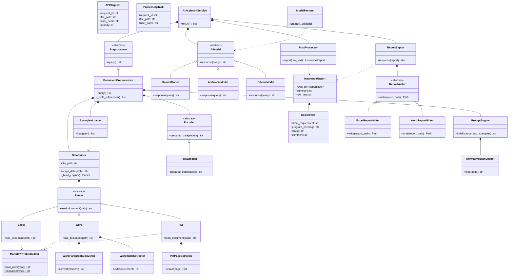

# Диаграмма классов

## Обозначения

| Символ | Смысл |
|--------|-------|
| `<\|--` | Наследование / реализация абстракции |
| `*--` | Композиция (класс владеет объектом) |
| `..>` | Зависимость (использует, но не владеет) |
| `<<abstract>>` | Абстрактный класс |
| `+` | Публичный метод / поле |
| `-` | Приватный метод / поле |
| `$` | Статический метод |
