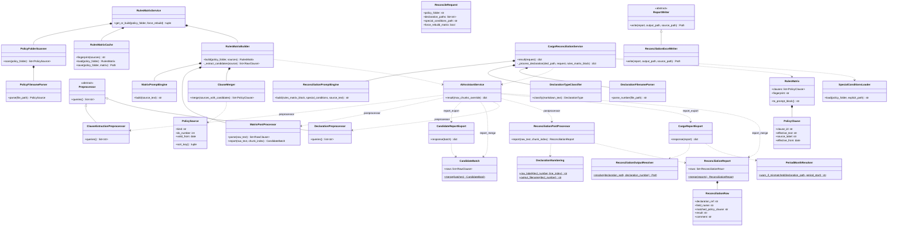

# Диаграмма классов

```mermaid
classDiagram
    direction TB

    %% ── API ──────────────────────────────────────────────────────────────────
    class APIRequest {
        +request_id: int
        +file_path: str
        +user_name: str
    }

    class ProcessingTask {
        +request_id: int
        +file_path: str
        +user_name: str
    }

    %% ── Orchestrator ─────────────────────────────────────────────────────────
    class AIAssistantService {
        +result() dict
        +rebuild_from_json() dict
    }

    %% ── Preprocessing ────────────────────────────────────────────────────────
    class DocumentPreprocessor {
        +queries() list~str~
        +query() str
    }

    class DocumentChunker {
        +split(text) list~str~
    }

    class ExamplesLoader {
        +load(path) list~str~
    }

    class DataParser {
        +origin_data(path) str
    }

    class Parser {
        <<abstract>>
        +read_document(path) str
    }

    class Excel { +read_document(path) str }
    class Word  { +read_document(path) str }
    class PDF   { +read_document(path) str }

    class TextEncoder {
        +prepared_data(source) str
    }

    class PromptEngine {
        +build(source_text, examples) str
    }

    class NormativeBaseLoader {
        +load(path) str
    }

    class NormativeIndex {
        +retrieve(query, budget) str
        +section_count int
    }

    class ContextBuilder {
        +build(template, role, examples, source_text) str
    }

    %% ── LLM Models ───────────────────────────────────────────────────────────
    class AIModel {
        <<abstract>>
        +response(query) str
    }

    class QwenModel {
        +response(query) str
        -_call_api(query) str
    }

    class ModelFactory {
        +create()$ AIModel
    }

    %% ── Postprocessing ───────────────────────────────────────────────────────
    class PostProcessor {
        +report(raw_text) InsuranceReport
    }

    class InsuranceReport {
        +rows: list~ReportRow~
        +summary: str
        +merge(reports)$ InsuranceReport
    }

    class ReportRow {
        +client_requirement: str
        +program_coverage: str
        +status: str
        +comment: str
    }

    %% ── Report Export ────────────────────────────────────────────────────────
    class ReportExport {
        +response(report) dict
    }

    class ReportWriter {
        <<abstract>>
        +write(report, path) Path
    }

    class ExcelReportWriter {
        +write(report, path) Path
        -_find_row_global(requirement, index) tuple
    }

    class WordReportWriter {
        +write(report, path) Path
    }

    %% ── Inheritance ──────────────────────────────────────────────────────────
    Parser        <|-- Excel
    Parser        <|-- Word
    Parser        <|-- PDF
    AIModel       <|-- QwenModel
    ReportWriter  <|-- ExcelReportWriter
    ReportWriter  <|-- WordReportWriter

    %% ── Composition ─────────────────────────────────────────────────────────
    AIAssistantService   *-- DocumentPreprocessor
    AIAssistantService   *-- PostProcessor
    AIAssistantService   *-- AIModel
    AIAssistantService   *-- ReportExport

    DocumentPreprocessor *-- DataParser
    DocumentPreprocessor *-- TextEncoder
    DocumentPreprocessor *-- PromptEngine
    DocumentPreprocessor *-- DocumentChunker
    DocumentPreprocessor *-- ExamplesLoader

    DataParser    *-- Parser
    PromptEngine  *-- NormativeBaseLoader
    PromptEngine  *-- NormativeIndex
    PromptEngine  *-- ContextBuilder
    ReportExport  *-- ReportWriter
    InsuranceReport *-- ReportRow

    %% ── Dependencies ─────────────────────────────────────────────────────────
    ModelFactory   ..> AIModel
    PostProcessor  ..> InsuranceReport
    ReportExport   ..> InsuranceReport
    ExcelReportWriter ..> NormativeIndex
```

## Обозначения

| Символ | Смысл |
|--------|-------|
| `<\|--` | Наследование / реализация абстракции |
| `*--` | Композиция (класс владеет объектом) |
| `..>` | Зависимость (использует, но не владеет) |
| `<<abstract>>` | Абстрактный класс |
| `+` | Публичный метод / поле |
| `-` | Приватный метод / поле |
| `$` | Статический метод |

---

# Диаграмма классов — сверка деклараций с ген. полисом (cargo)

Второй пайплайн (`document_assistant/cargo/`), **не** параллельный оркестратор: каждый вызов ИИ (извлечение пунктов из документа полиса/ДС, сверка одной декларации) выполняется через `AIAssistantService` — тот же класс, что использует ДМС-пайплайн (`services/assistant.py`), а не отдельная копия retry/чанк-цикла. `RulesMatrixBuilder` и `CargoReconciliationService` собирают cargo-специфичные preprocessor/postprocessor/report_export и передают их в `AIAssistantService`; `ClauseMerger` (приоритет ДС) и запись в файл — единственная логика, которая реально уникальна для cargo.

Переиспользуются напрямую, без изменений интерфейсов: `DataParser`, `TextEncoder`, `AIModel`/`ModelFactory`, `DocumentChunker`, `MarkdownTableParser`, `ProcessingTask` — и, что важнее, базовый класс `Preprocessor` (`ai/preprocessor.py`, оба cargo-препроцессора его наследуют) и абстрактный `ReportWriter` (`reports/writers.py`, `ReconciliationExcelWriter` — вторая его реализация наряду с `ExcelReportWriter`/`WordReportWriter`).

```mermaid
classDiagram
    direction TB

    %% ── Shared orchestrator (services/assistant.py) ────────────────────────────
    class AIAssistantService {
        +result(max_chunks_override) dict
    }

    class Preprocessor {
        <<abstract>>
        +queries() list~str~
    }

    class ReportWriter {
        <<abstract>>
        +write(report, output_path, source_path) Path
    }

    %% ── API ──────────────────────────────────────────────────────────────────
    class ReconcileRequest {
        +policy_folder: str
        +declaration_paths: list~str~
        +special_conditions_path: str
        +force_rebuild_matrix: bool
    }

    %% ── Discovery & filenames ────────────────────────────────────────────────
    class PolicyFilenameParser {
        +parse(file_path) PolicySource
    }

    class DeclarationFilenameParser {
        +parse_number(file_path) str
    }

    class PolicyFolderScanner {
        +scan(policy_folder) list~PolicySource~
    }

    %% ── Rules matrix ─────────────────────────────────────────────────────────
    class RulesMatrixService {
        +get_or_build(policy_folder, force_rebuild) tuple
    }

    class RulesMatrixCache {
        +fingerprint(sources) str
        +load(policy_folder) RulesMatrix
        +save(policy_folder, matrix) Path
    }

    class RulesMatrixBuilder {
        +build(policy_folder, sources) RulesMatrix
        -_extract_candidates(source) list~RawClause~
    }

    class ClauseExtractionPreprocessor {
        +queries() list~str~
    }

    class ClauseMerger {
        +merge(sources_with_candidates) list~PolicyClause~
    }

    class MatrixPromptEngine {
        +build(source_text) str
    }

    class MatrixPostProcessor {
        +parse(raw_text) list~RawClause~
        +report(raw_text, chunk_index) CandidateBatch
    }

    class CandidateBatch {
        +rows: list~RawClause~
        +merge(batches)$ CandidateBatch
    }

    class CandidateReportExport {
        +response(batch) dict
    }

    class RulesMatrix {
        +clauses: list~PolicyClause~
        +fingerprint: str
        +to_prompt_block() str
    }

    class PolicyClause {
        +clause_id: str
        +effective_text: str
        +source_label: str
        +effective_from: date
    }

    class PolicySource {
        +kind: str
        +ds_number: int
        +valid_from: date
        +sort_key() tuple
    }

    %% ── Declaration classification ───────────────────────────────────────────
    class DeclarationTypeClassifier {
        +classify(markdown_text) DeclarationType
    }

    class DeclarationNumbering {
        +row_label(decl_number, line_index)$ str
        +output_filename(decl_number)$ str
    }

    %% ── Special conditions ───────────────────────────────────────────────────
    class SpecialConditionsLoader {
        +load(policy_folder, explicit_path) str
    }

    %% ── Reconciliation ───────────────────────────────────────────────────────
    class CargoReconciliationService {
        +result(request) dict
        -_process_declaration(decl_path, request, rules_matrix_block) dict
    }

    class DeclarationPreprocessor {
        +queries() list~str~
    }

    class ReconciliationPromptEngine {
        +build(rules_matrix_block, special_conditions, source_text) str
    }

    class ReconciliationPostProcessor {
        +report(raw_text, chunk_index) ReconciliationReport
    }

    class ReconciliationReport {
        +rows: list~ReconciliationRow~
        +merge(reports)$ ReconciliationReport
    }

    class ReconciliationRow {
        +declaration_ref: str
        +field_name: str
        +matched_policy_clause: str
        +result: str
        +comment: str
    }

    class ReconciliationExcelWriter {
        +write(report, output_path, source_path) Path
    }

    class CargoReportExport {
        +response(report) dict
    }

    class ReconciliationOutputResolver {
        +resolve(declaration_path, declaration_number)$ Path
    }

    class PeriodMonthResolver {
        +warn_if_mismatched(declaration_path, period_start)$ str
    }

    %% ── Inheritance ──────────────────────────────────────────────────────────
    Preprocessor  <|-- ClauseExtractionPreprocessor
    Preprocessor  <|-- DeclarationPreprocessor
    ReportWriter  <|-- ReconciliationExcelWriter

    %% ── AIAssistantService runs per policy/ДС document and per declaration ──
    AIAssistantService ..> ClauseExtractionPreprocessor : preprocessor
    AIAssistantService ..> MatrixPostProcessor : postprocessor
    AIAssistantService ..> CandidateReportExport : report_export
    AIAssistantService ..> CandidateBatch : report_merge

    AIAssistantService ..> DeclarationPreprocessor : preprocessor
    AIAssistantService ..> ReconciliationPostProcessor : postprocessor
    AIAssistantService ..> CargoReportExport : report_export
    AIAssistantService ..> ReconciliationReport : report_merge

    %% ── Composition ──────────────────────────────────────────────────────────
    RulesMatrixService   *-- PolicyFolderScanner
    RulesMatrixService   *-- RulesMatrixCache
    RulesMatrixService   *-- RulesMatrixBuilder
    RulesMatrixBuilder   *-- MatrixPromptEngine
    RulesMatrixBuilder   *-- MatrixPostProcessor
    RulesMatrixBuilder   *-- ClauseMerger
    RulesMatrixBuilder   ..> AIAssistantService
    RulesMatrix          *-- PolicyClause
    PolicyFolderScanner  *-- PolicyFilenameParser
    ClauseMerger         ..> PolicySource
    CandidateReportExport ..> CandidateBatch

    CargoReconciliationService *-- ReconciliationPromptEngine
    CargoReconciliationService *-- DeclarationTypeClassifier
    CargoReconciliationService *-- DeclarationFilenameParser
    CargoReconciliationService ..> AIAssistantService
    CargoReconciliationService ..> RulesMatrix
    CargoReconciliationService ..> SpecialConditionsLoader
    CargoReportExport ..> ReconciliationOutputResolver
    CargoReportExport ..> PeriodMonthResolver
    ReconciliationPostProcessor ..> DeclarationNumbering
    ReconciliationReport *-- ReconciliationRow
    ReconciliationPostProcessor ..> ReconciliationReport
```
